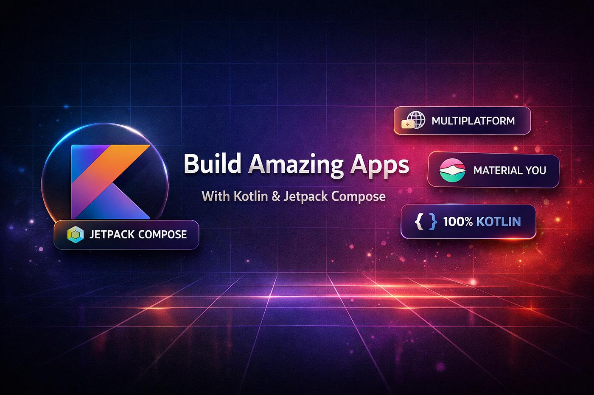

# 🚀 Android Interview Bible (2026 Edition)

<div align="center">

### The Ultimate Android Interview Preparation Repository for Kotlin, Jetpack Compose, Coroutines, KMP, Ktor, Android System Design & FAANG Interviews.

<p align="center">
  
</p>

<p align="center">
  
  
  
  
</p>

<p align="center">
  
  
  
</p>

⭐ **If this repository helps you, please consider giving it a Star!**

</div>

---

# 📚 About This Repository

This repository is a **complete Android Interview Preparation Guide** created for Android Developers preparing for **Product-Based Companies**.

Unlike traditional interview repositories, this project is designed as a **structured learning roadmap** with in-depth notes, diagrams, code examples, interview questions, machine coding problems, system design, cheat sheets, and revision guides.

Whether you're preparing for:

- Google
- Amazon
- Uber
- Microsoft
- PhonePe
- Razorpay
- Swiggy
- Flipkart
- CRED
- Meesho
- Walmart Global Tech

This repository aims to be your **single source of truth**.

---

# 🎯 Who Is This Repository For?

| Experience | Coverage |
|------------|----------|
| **0–2 Years** | Android fundamentals, Kotlin basics, Android SDK |
| **2–4 Years** | Coroutines, Flow, MVVM, Room, Navigation |
| **4–6 Years** | Compose, Performance, Testing, Architecture |
| **6–8 Years** | Compose Runtime, Android Internals, Hilt, Modularization |
| **8–10+ Years** | System Design, KMP, Performance Engineering, Staff-Level Android |

---

# ✨ What Makes This Repository Different?

- 📖 Structured like a technical book.
- 🧠 Interview-focused explanations.
- 💻 Production-quality Kotlin & Compose examples.
- 🎨 Diagrams for complex concepts.
- ⚙️ Android Framework Internals.
- 🚀 Performance Optimization.
- 🏗️ System Design for Android Apps.
- 📱 Machine Coding Round Preparation.
- 📝 Printable Cheat Sheets.
- 🎯 Company-wise Interview Guides.

---

# 📈 Repository Coverage

| Category | Notes |
|----------|------:|
| Kotlin | 70+ |
| Coroutines | 40+ |
| Flow / StateFlow / SharedFlow | 35+ |
| Jetpack Compose | 120+ |
| Android Core Framework | 90+ |
| Jetpack Libraries | 45+ |
| Architecture | 40+ |
| Dependency Injection | 35+ |
| Kotlin Multiplatform (KMP) | 40+ |
| Ktor Networking | 25+ |
| Performance Engineering | 50+ |
| Testing | 35+ |
| Android System Design | 25+ |
| Machine Coding Projects | 25 |
| Company-wise Interview Guides | 10+ |
| Cheat Sheets | 20+ |

---

# 🗺️ Android Interview Roadmap

```text
Android Developer Roadmap

Getting Started
      │
      ▼
 Kotlin Mastery
      │
      ▼
 Coroutines & Flow
      │
      ▼
 Jetpack Compose
      │
      ▼
 Android Core Framework
      │
      ▼
 Architecture + DI
      │
      ▼
 Testing + Performance
      │
      ▼
 KMP + Ktor
      │
      ▼
 System Design
      │
      ▼
 Machine Coding
      │
      ▼
 Company Specific Preparation
```

📌 A complete roadmap is available in **ROADMAP.md**.

---

# 📑 Repository Structure

```text
android-interview-bible/

├── 00-Getting-Started
├── 01-Kotlin
├── 02-Coroutines
├── 03-Flow
├── 04-Jetpack-Compose
├── 05-Android-Core
├── 06-Jetpack-Libraries
├── 07-Architecture
├── 08-Dependency-Injection
├── 09-KMP
├── 10-Ktor
├── 11-Performance
├── 12-Testing
├── 13-System-Design
├── 14-Machine-Coding
├── 15-Company-Wise
├── 16-Behavioral
├── 17-DSA-For-Android
├── 18-Cheat-Sheets
└── 19-Interview-Tracker
```

---

# 📚 Table of Contents

## 🚀 Getting Started

- Android Interview Preparation Strategy
- Resume Guide
- LinkedIn Optimization
- GitHub Portfolio Guide
- Interview Preparation Strategy
- Salary Negotiation Guide

---

## 📘 Kotlin

- Variables
- Null Safety
- Functions
- Lambda
- Higher Order Functions
- Scope Functions
- Collections
- Sequences
- OOP
- Data Classes
- Delegation
- Generics
- Variance
- Reflection
- DSL
- JVM Internals
- Kotlin Compiler
- Bytecode
- Interview Questions

---

## ⚡ Coroutines

- CoroutineScope
- Dispatchers
- Jobs
- Structured Concurrency
- Cancellation
- Exception Handling
- Channels
- Mutex
- Semaphore
- Coroutine Scheduler
- Testing Coroutines
- Interview Questions

---

## 🌊 Flow

- Flow Basics
- Cold vs Hot Flow
- StateFlow
- SharedFlow
- callbackFlow
- channelFlow
- Operators
- shareIn
- stateIn
- snapshotFlow
- Retry
- Buffer
- Interview Questions

---

## 🎨 Jetpack Compose

### Fundamentals

- Composable Functions
- Composition
- Recomposition
- State Management
- Remember
- rememberSaveable
- MutableState
- State Hoisting

### Layouts

- Column
- Row
- Box
- ConstraintLayout
- LazyColumn
- LazyGrid
- Custom Layout
- SubcomposeLayout
- LookaheadLayout

### Modifiers

- Layout Modifier
- Draw Modifier
- Pointer Modifier
- Semantics
- ParentDataModifier

### Side Effects

- LaunchedEffect
- DisposableEffect
- SideEffect
- produceState
- derivedStateOf
- snapshotFlow

### Navigation

- Navigation Compose
- Nested Graph
- Bottom Navigation
- Multiple Back Stack
- Deep Links
- Predictive Back

### Animation

- AnimatedVisibility
- AnimatedContent
- Transition
- InfiniteTransition
- Shared Element
- Gesture Animation

### Canvas & Graphics

- Canvas
- DrawScope
- Path
- Brush
- Shader
- BlendMode

### Runtime Internals

- Composer
- Slot Table
- Snapshot System
- Recomposer
- Stability
- Compiler Plugin
- Strong Skipping

### Performance

- Recomposition Optimization
- Lazy Performance
- State Optimization
- Compose Tracing

---

## 🤖 Android Core

- Activity Lifecycle
- Fragment Lifecycle
- ViewModel
- SavedStateHandle
- Lifecycle
- Intents
- Broadcast Receiver
- Services
- WorkManager
- Content Provider
- Binder IPC
- Looper
- Handler
- Choreographer
- Window Manager
- Storage
- Permissions

---

## 📦 Jetpack Libraries

- Navigation
- Paging 3
- Room
- DataStore
- WorkManager
- CameraX
- Media3
- Security

---

## 🏗️ Architecture

- MVC
- MVP
- MVVM
- MVI
- UDF
- Clean Architecture
- Repository Pattern
- Offline First
- Modularization
- Design Patterns

---

## 💉 Dependency Injection

- Hilt
- Dagger
- Koin
- Manual DI
- Assisted Injection
- Scopes
- Components
- Compose Integration

---

## 🌍 Kotlin Multiplatform (KMP)

- KMP Basics
- Expect / Actual
- Shared Modules
- Compose Multiplatform
- SQLDelight
- Resources
- Shared Navigation
- Testing

---

## 🌐 Ktor

- HttpClient
- Serialization
- Authentication
- Plugins
- Retry
- Logging
- SSL Pinning
- WebSockets

---

## 🚀 Performance Engineering

- Memory Management
- Garbage Collection
- Memory Leaks
- LeakCanary
- Startup Optimization
- Macrobenchmark
- Baseline Profiles
- Compose Performance
- JankStats
- R8 / Proguard

---

## ✅ Testing

- JUnit5
- MockK
- Mockito
- Turbine
- Compose UI Testing
- Screenshot Testing
- Integration Testing
- End-to-End Testing

---

## 🏛️ Android System Design

- WhatsApp
- Instagram
- YouTube
- Banking App
- Food Delivery App
- Ecommerce App
- Offline Sync Engine
- Notification System
- Caching
- Pagination

---

## 💻 Machine Coding

- Chat App
- Expense Tracker
- Notes App
- Weather App
- Music Player
- WhatsApp Clone
- Ecommerce App
- Netflix Clone

---

## 🏢 Company-wise Interview Preparation

- Google
- Amazon
- Uber
- PhonePe
- Flipkart
- Razorpay
- Swiggy
- Microsoft
- CRED
- Walmart Global Tech

Each company includes:

- Interview Process
- Android Questions
- Machine Coding
- System Design
- Behavioral Questions

---

## 🧠 Behavioral Interviews

- Tell Me About Yourself
- STAR Technique
- Leadership
- Conflict Resolution
- Project Deep Dive
- Ownership
- Mentoring
- Failure Stories

---

## 💡 DSA for Android

- Arrays
- Strings
- Linked List
- Stack
- Queue
- Trees
- Graph
- Heap
- Sliding Window
- Dynamic Programming

All implemented in **Kotlin**.

---

## 📄 Cheat Sheets

Quick revision notes for:

- Kotlin
- Coroutines
- Flow
- Compose
- Android Core
- Architecture
- Hilt
- Performance
- KMP
- Navigation

Perfect before interviews.

---

# 📅 90-Day Interview Study Plan

| Phase | Duration | Topics |
|-------|----------|--------|
| Phase 1 | Days 1–15 | Kotlin Fundamentals |
| Phase 2 | Days 16–30 | Coroutines + Flow |
| Phase 3 | Days 31–60 | Jetpack Compose Complete |
| Phase 4 | Days 61–75 | Android Core + Architecture |
| Phase 5 | Days 76–85 | Performance + Testing |
| Phase 6 | Days 86–90 | System Design + Mock Interviews |

📌 Detailed plan available in **STUDY_PLAN.md**

---

# 📊 Interview Progress Tracker

## Kotlin

- [ ] Basics
- [ ] OOP
- [ ] Functions
- [ ] Collections
- [ ] Generics
- [ ] Reflection
- [ ] JVM Internals

## Coroutines

- [ ] CoroutineScope
- [ ] Dispatchers
- [ ] Jobs
- [ ] Cancellation
- [ ] Channels

## Flow

- [ ] Flow Basics
- [ ] StateFlow
- [ ] SharedFlow
- [ ] callbackFlow
- [ ] Operators

## Jetpack Compose

- [ ] State Management
- [ ] Layouts
- [ ] Modifiers
- [ ] Side Effects
- [ ] Navigation
- [ ] Animation
- [ ] Runtime Internals
- [ ] Performance

## Android Core

- [ ] Lifecycle
- [ ] ViewModel
- [ ] Services
- [ ] WorkManager
- [ ] Binder
- [ ] Storage

## Architecture

- [ ] MVVM
- [ ] MVI
- [ ] Clean Architecture
- [ ] Modularization

## Performance

- [ ] Memory
- [ ] Startup
- [ ] Macrobenchmark
- [ ] Baseline Profiles

---

# 🎯 Company Preparation Matrix

| Company | Focus Topics |
|----------|-------------|
| Google | Compose Runtime, Coroutines, System Design |
| Amazon | Android Core, OOP, Behavioral |
| Uber | Architecture, Performance, Compose |
| PhonePe | Coroutines, Flow, Offline First |
| Flipkart | Machine Coding, MVVM |
| Razorpay | Networking, Security, DI |
| Swiggy | Performance, Paging, Offline Sync |
| Microsoft | Kotlin, Architecture |
| Walmart | Modularization, Testing |
| CRED | Compose Animation, Performance |

---

# 🏆 Repository Goals

- [x] Kotlin Interview Notes
- [ ] Coroutines Bible
- [ ] Flow Bible
- [ ] Jetpack Compose Bible
- [ ] Android Core Bible
- [ ] Architecture Bible
- [ ] Hilt + Dagger Bible
- [ ] KMP Bible
- [ ] Ktor Bible
- [ ] Performance Bible
- [ ] Testing Bible
- [ ] System Design Bible
- [ ] Machine Coding Bible
- [ ] Company Interview Bible

---

# 📝 Note Format

Every topic in this repository follows a consistent structure.

```md
# Topic Name

## Definition

## Why It Matters

## Internal Working

## Runtime Behavior

## Memory Diagram

## Code Example

## Production Use Case

## Best Practices

## Common Mistakes

## Comparison Table

## Interview Questions

## Cheat Sheet
```

This makes revision easy and keeps the repository consistent.

---

# 📖 Recommended Study Order

1. Kotlin
2. Coroutines
3. Flow
4. Jetpack Compose
5. Android Core
6. Architecture
7. Dependency Injection
8. Performance
9. Testing
10. KMP
11. Ktor
12. System Design
13. Machine Coding
14. Company-wise Interviews

---

# 🤝 Contributing

Contributions are welcome!

If you'd like to improve interview questions, code examples, diagrams, or fix mistakes:

1. Fork the repository.
2. Create a feature branch.
3. Commit your changes.
4. Open a Pull Request.

Please follow **CONTRIBUTING.md**.

---

# 🌟 Support This Project

If this repository helps you prepare for Android interviews:

- ⭐ Star this repository.
- 🍴 Fork it.
- 📢 Share it with other Android developers.
- 💙 Contribute improvements.

---

<div align="center">

## Happy Learning & Best of Luck for Your Android Interviews! 🚀

**Made with ❤️ for the Android Developer Community**

**Author:** Vikash Kumar Verma

</div>